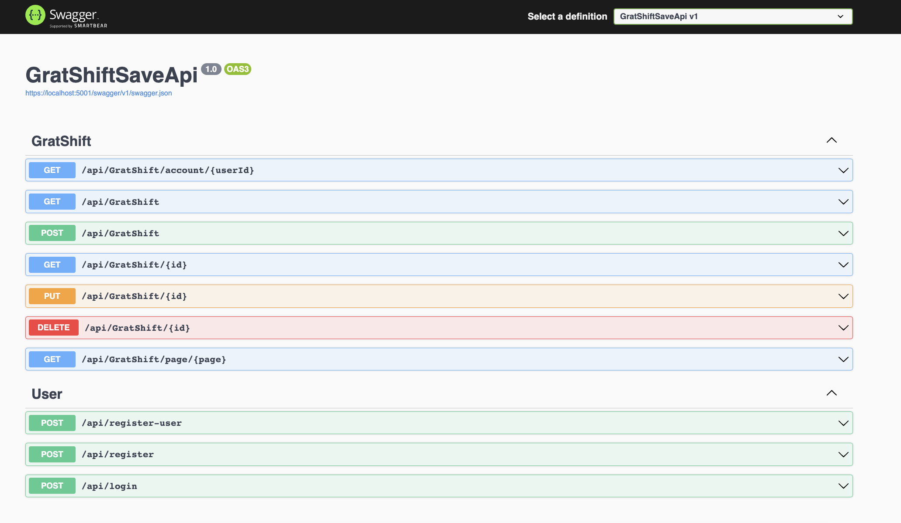

<h1 align="center"> Grat Shift Save API</h1>

<h3 align="center">By Eliot Gronstal 5.11.23</h3>

<h3 align="center"> A web API created to host and track an authenticated user's gratuity based income using a MySQL database. It was made with JWT for Authentication and uses Entity and Identity Frameworks. A Google Firestore database table called "Users" is also created for the purpose of utilizing that informtation for the app's corresponding React.js front end.</h3>

## Technologies Used

* _C#_
* _.NET Core 6.0_
* _Google Firestore_
* _Microsoft Azure_
* _MySQL Workbench_
* _Entity Framework_
* _Identity Framework_
* _JWT_
* _Swagger_
* _Postman_

## Description

There are custom endpoints for some of these user stories:

* A user can GET and POST shift information about a shift they have worked.

* A user can edit income information about a shift they have worked.

* A user can delete income information about a shift they have worked.

* A user can access the API endpoint with a query parameter that specifies a page which should be returned.

## Setup/Installation Requirements

_Requires console application such as Git Bash, Terminal, or PowerShell_

1. Open Git Bash or PowerShell if using Windows and Terminal if using Mac

2. Run the command

   `git clone https://github.com/elgrons/GratShiftSaveApi.Solution`

3. Run the command and open the project file.

   `cd GratShiftSaveApi.Solution`

4. Create a `.gitignore` file in the root folder. This project will require use of sensitive information that should not be publicly shared.

5. You should now have a folder `GratShiftSaveApi` with the following structure.
    <pre>GratShiftSaveApi.Solution
    ├── .gitignore 
    ├── ... 
    └── GratShiftSaveApi
        ├── Controllers
        ├── Models
        ├── ...
        ├── README.md</pre>

6. Create a `.gitignore` file in the root folder. This project will require use of sensitive information that should not be publicly shared.

7. Copy and paste the following information into the .gitignore file:
```text
obj
bin
appsettings.json
serviceaccountkey.json
```

8. Create two files in the following location, inside the GratShiftSaveApi folder:

  * One named `appsettings.json`
  * Another named `serviceaccountkey.json`

<pre>GratShiftSaveApi.Solution
├── .gitignore 
├── ... 
└── GratShiftSaveApi
    ├── Controllers
    ├── Models
    ├── ...
    └── <strong>serviceaccountkey.json</strong>
    └── <strong>appsettings.json</strong></pre>

9. Copy and paste the text below into serviceaccountkey.json. 

```json
{
  "type": "service_account",
  "project_id": "[YOUR-PROJECT-ID]",
  "private_key_id": "[YOUR-PRIVATE-KEY-ID]",
  "private_key": "[YOUR-PRIVATE-KEY]",
  "client_email": "[YOUR-CLIENT-EMAIL]",
  "client_id": "[YOUR-CLIENT-ID]",
  "auth_uri": "[YOUR-AUTH-URI]",
  "token_uri": "[YOUR-TOKEN-URI]",
  "auth_provider_x509_cert_url": "[YOUR-AUTH-PROVIDER-CERT-URL]",
  "client_x509_cert_url": "[YOUR-CLIENT-CERT-URL]",
  "universe_domain": "googleapis.com"
}
```
10. Replace the informoration within the curly brackets with your Firebase service account private key. To generate that key you will need to:

    <strong>*NOTE*</strong> If you are not planning on using this Web Api with the corresponding React.js front-end the following instructions within Step 7 are not required and you may skip ahead to Step 8.

  * Set up a [Firebase account](https://firebase.google.com/)
  * Click on "Get Started", then "+ Add Project" to create a Firebase project that will hold the Firestore database and corresponding app.
  * In the middle of the homepage we'll see the message "Get started by adding Firebase to your app". This area gives us options to configure our Firebase to connect to a web app, an Android app, or an iOS app. The <strong></></strong> icon inside the circle represents web apps.
  * Set up a Firestore database by clicking on the "Build" tab in the left-hand menu, and then select Firestore Database.
  * Click on the create database button and do the following:
    - Start in Test Mode and click through
    - Leave the default form values and click "Enable"
  * Add Firebase to the web app by clicking the </> button and be taken to a page that reads "Add Firebase to your web app".
  * Enter an app nickname and click "Continue to console" which will guide you back to the project homepage.
  * Click on the gear icon next to "Project Overview" in the leftside menu bar and select "Project Settings".
  * Within "Project Settings" select "Service Accounts" and scroll to the bottom right of the page and select "Generate new private key". See the diagram below for details:
  
  * The private key will be downloaded to your local computer. Copy the information and put it into your serviceaccountkey.json file.

11. Copy and paste below JSON text in appsettings.json.

```json
{
   "Logging": {
    "LogLevel": {
      "Default": "Warning",
      "System": "Information",
      "Microsoft": "Information"
    }
  },
   "AllowedHosts": "*",
  "ConnectionStrings": {
    "DefaultConnection": "Server=localhost;Port=3306;database=gratshiftsave_api;uid=[YOUR-USERNAME-HERE];pwd=[YOUR-PASSWORD-HERE];"
  },
  "JWT": {
    "ValidAudience": "http://localhost:4200",
    "ValidIssuer": "http://localhost:5000",
    "Secret": "JWTAuthenticationHIGHsecuredPasswordVVVp1OH7Xzyr"
  },
    "Firestore": {
        "ProjectId": "[YOUR-PROJECT-ID]"
    }
}
```

12. Replace [YOUR-USERNAME-HERE] with your MySQL username.

13. Replace [YOUR-PASSWORD-HERE] with your MySQL password.

14. Replace [YOUR-PROJECT-ID] with your Firestore project ID from your service account key.

15. Run the command

   `dotnet ef database update`

<strong>To Run an Entity Framework database migration</strong>

Navigate to the following directory in the console
<pre>GratShiftSaveApi.Solution
└── <strong>GratShiftSaveApi</strong></pre>

Run the following command in the console

`dotnet build`

Then run the following command in the console

`dotnet run`

This program was built using _`Microsoft .NET SDK 6.0`_, and may not be compatible with other versions. The performance of this app with other versions is not insinuated nor assured.

## API Documentation

Explore the API endpoints in Postman or in a browser. You will not be able to utilize authentication in a browser so using Postman is recommended.

### Swagger Documentation

To view the Swagger documentation for the GratShiftSaveApi, launch the project using `dotnet run` using Terminal or Powershell, then input the following URL into your browser: `https://localhost:5001/swagger/index.html`



### HTTP Request Structure

If you're using `dotnet run` the following endpoints can be used via localhost:
```
GET https://localhost:5001/api/GratShift
GET https://localhost:5001/api/GratShift
GET https://localhost:5001/api/GratShift/account/{userId}
POST https://localhost:5001/api/GratShift
PUT https://localhost:5001/api/GratShift/{id}
DELETE https://localhost:5001/api/GratShift/{id}
GET https://localhost:5001/api/GratShift/page/{page}

POST https://localhost:5001/api/register
POST https://localhost:5001/api/register-user
POST https://localhost:5001/api/login
```
The API is also deployed via Microsoft Azure and endpoints can be explored via the following domain:
```
GET https://grat-shift-save-api.azurewebsites.net/api/GratShift
GET https://grat-shift-save-api.azurewebsites.net/api/GratShift/account/{userId}
POST https://grat-shift-save-api.azurewebsites.net/api/GratShift
PUT https://grat-shift-save-api.azurewebsites.net/api/GratShift/{id}
DELETE https://grat-shift-save-api.azurewebsites.net/api/GratShift/{id}
GET https://grat-shift-save-api.azurewebsites.net/api/GratShift/page/{page}

POST https://grat-shift-save-api.azurewebsites.net/api/register
POST https://grat-shift-save-api.azurewebsites.net/api/register-user
POST https://grat-shift-save-api.azurewebsites.net/api/login
```

### Registration, and Login with JWT-based Authentication

## Registration
- To register a user in Postman the following structure is required for the POST request:
```
{
    "Username":"TestAccount",
    "Email": "testAccount@email.com",
    "Password":"Password123!"
}
```


## Login and JWT Retrieval

- To login a user in Postman the previous structure in the body (that contains Username, Email, and Password data) may remain. For the login POST request ensure the endpoint is updated from "register" to "login".


- Before you make a GET request, copy and paste the JWT token from the body (without the quotation marks surrounding it).
- Select the "Authorization" field and select "JWT Bearer" from the drop down menu. Paste the token string into the field in the upper body of the form.


- Now you are ready to create a GET request to get all available GratShift data from the database. *Note, no GratShifts have been returned in the example below becuase the database was cleared for example purposes.*


### Generating New Instance of GratShift

- To utilize the POST request and create a new instance of a GratShift, the following information structure is required, while the actual information input can vary.

```
{
  "gratShiftId": "int",
  "cashTip": "int",
  "creditTip": "int",
  "shiftSales": "int",
  "shiftDate": "2023-05-12T19:06:17.234Z"
}
```

#### Example Query

```
https://localhost:5001/api/GratShift/1
```

or using the hosted domain

```
https://grat-shift-save-api.azurewebsites.net/api/GratShift/1
```

#### Sample JSON Response

For an instance of a GratShift:
```
{
  "gratShiftId": 1,
  "cashTip": 100,
  "creditTip": 300,
  "shiftSales": 1800,
  "shiftDate": "2023-03-01T00:00:00"
}
```
For an instance of creating a user:
```
{
    "Username":"TestAccount",
    "Email": "testAccount@email.com",
    "Password":"Password123!"
}
```

## Pagination

- Paging refers to getting a smaller selection of results from GratShiftSaveApi and browsing through page by page.

- Example pagination endpoint: Change the page number in the URL: https://localhost:5001/api/GratShift/page/1


## Known Bugs

- _Only admin users are currently able to Get, Post, Patch, and Delete._

- _Reach out with any questions or concerns to [eliot.lauren@gmail.com](eliot.lauren@gmail.com)_

## License

[MIT](/LICENSE)

Copyright 2023 Eliot Gronstal